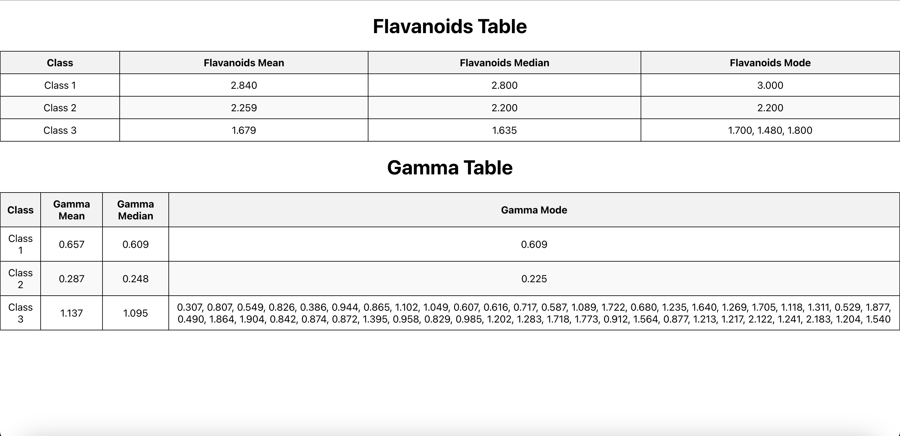

# Manufac Assignment

Gamma Statistics and Flavanoids Table

## Description

This project calculates class-wise statistics for Gamma and Flavanoids based on the provided data.

## Installation

Install the project with yarn

1. Clone the repository.
2. Run the following commands in terminal to install the dependencies.
```bash
  yarn install
  cd manufac
```
## Run the project

Install the project with yarn

1. Run the following commands in terminal to run the project.
```bash
  yarn start
```
Open [http://localhost:3000](http://localhost:3000) to view it in the browser.

## Usage

### Flavanoids Table

1. Import the required data and utility functions from the respective files.
2. Call the `calculateClassStatistics` function with the data to calculate class-wise statistics for Flavanoids.
3. Use the calculated statistics to display the Flavanoids table.

```javascript
import data from '../Wine-Data.json';
import { calculateMean, calculateMedian, calculateMode } from '../utils/statistics';

// Rest of the code

```

### Gamma Table

1. Import the required data and utility functions from the respective files.
2. Call the `calculateClassStatistics` function with the data to calculate class-wise statistics for Gamma.
3. Use the calculated statistics to display the Gamma table.

```javascript
import data from '../Wine-Data.json';
import { calculateMean, calculateMedian, calculateMode } from '../utils/statistics';

// Rest of the code

```

### Utility functions

You could find the utility functions in `utils/statistics`.

     Utility function to calculate the `mean, median and mode`.


## Output

